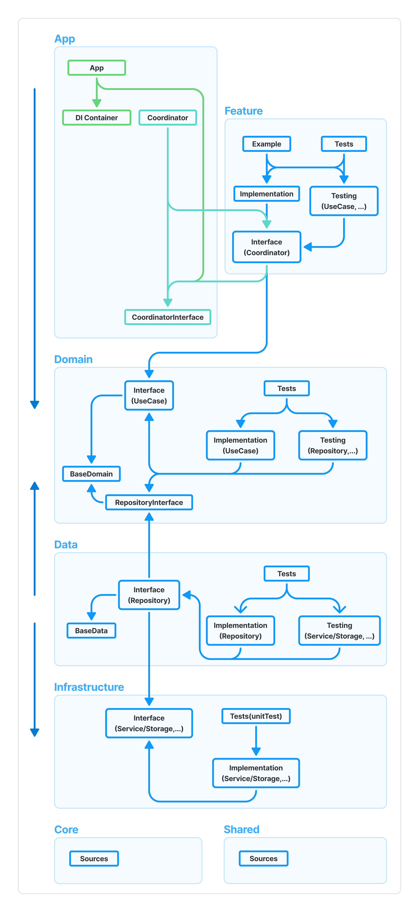

# ClarchPlugin


### 📖 Overview

**Tuist Clean Architecture Plugin**

> The **ClarchPlugin** is a tool that helps iOS developers scaffold projects following the Clean Architecture pattern using Tuist.
> It promotes **Domain-Driven Design (DDD)** by structuring code around core business logic and separating concerns into layers like Presentation, Domain, and Data. At the same time, it encourages **Test-Driven Development (TDD)** by generating testable modules and boilerplate test files, making it easier to write and maintain tests from the start.
> This plugin streamlines the setup process, enforces architectural consistency, and supports scalable, maintainable app development.

<br/>

### 🧑‍💻 Development Environment


<br/>

### 📦 Project Architecture Overview

<strong>Clarch Architecture & Dependencies</strong>



<br/>

<details>
<summary>
<strong>Directory Structure</strong>
</summary>


```text
[Project]
├── Workspace.swift
├── App/
│    ├── {{ appName }}/
│    │    ├── Project.swift
│    │    ├── Sources/
│    │    └── Resources/
│    ├── {{ name }}DIContainer/
│    │    ├── Project.swift
│    │    └── Sources/
│    ├── {{ name }}Coordinator/
│    │    ├── Project.swift
│    │    └── Sources/
│    └── {{ name }}CoordinatorInterface/
│         ├── Project.swift
│         └── Sources/
│     
├── Feature/
│    └── {{ name }}Feature/
│         ├── Project.swift
│         ├── Interface/
│         │    └── Sources/
│         ├── Implementation/
│         │    ├── Sources/
│         │    └── Resources/
│         ├── Testing/
│         │    └── Sources/
│         ├── Tests/
│         │    └── Sources/
│         └── Example/
│              └── Sources/
│     
├── Domain/
│    ├── {{ name }}BaseDomain/
│    │    ├── Project.swift
│    │    └── Sources/
│    ├── {{ name }}RepositoryInterfaces/
│    │    ├── Project.swift
│    │    └── {{ repositoryName }}RepositoryInterface/
│    │         └── Sources/
│    └── {{ name }}Domain/
│         ├── Project.swift
│         ├── Interface/
│         │    └── Sources/
│         ├── Implementation/
│         │    └── Sources/
│         ├── Testing/
│         │    └── Sources/
│         └── Tests/
│              └── Sources/
│     
├── Data/
│    ├── {{ name }}BaseData/
│    │    ├── Project.swift
│    │    └── Sources/
│    └── {{ name }}Data/
│         ├── Project.swift
│         ├── Interface/
│         │    └── Sources/
│         ├── Implementation/
│         │    └── Sources/
│         ├── Testing/
│         │    └── Sources/
│         └── Tests/
│              └── Sources/
│     
├── Infrastructure/
│    └── {{ name }}Infrastructure/
│         ├── Project.swift
│         ├── Interface/
│         │    └── Sources/
│         ├── Implementation/
│         │    └── Sources/
│         └── Tests/
│              └── Sources/
│     
├── Core/
│    └── Core{{ name }}/
│         ├── Project.swift
│         └── Sources/
│
└── Shared/
     └── Shared{{ name }}/
          ├── Project.swift
          └── Sources/
```

</details>

<br/>

---

### 🛠️ Prepare

> To do this, open your Tuist project for editing by running the following command in your project directory:
> `tuist edit`

**1. Add the plugin to your project configuration**

In your Tuist/Config.swift file:

```swift
// Example
let config = Config(
    plugins: [
        .git(url: "https://github.com/JHKits/ClarchPlugin", tag: "1.1.0") // ClarchPlugin
    ],
    generationOptions: .options()
)
```

<br/>

**2. Set up your workspace using ClarchPlugin**

In your Workspace.swift file:

```swift
@preconcurrency import ProjectDescription
import ClarchPlugin

let workspace = Workspace(
    name: "name",
    projects: ClarchConfiguration.workspacePaths
)
```

or 

```swift
@preconcurrency import ProjectDescription

let workspace = Workspace(
    name: "name",
    projects: [
        "App/**",
        "Feature/**",
        "Data/**",
        "Infrastructure/**",
        "Core/**",
        "Shared/**"
    ]
)
```

<br/>

---

### 🚀 Usage

> ℹ️ Note: Suffixes like `Domain`, `Data`, and `RepositoryInterface` are automatically appended.  
> Modules under `Core` and `Shared` are designed to be accessible from any layer.

<br/>

<details>
<summary>
<strong>[App Layer]</strong>
</summary>

**App**

Represents the main application target, including the app's entry point, main UI, and configuration.

directory: `App/{{ appName }}`  
use: `/Sources`, `/Resources`  
dependable: `.diContainer`, `.coordinatorInterface`


```swift
@preconcurrency import ProjectDescription
import ClarchPlugin

nonisolated(unsafe) let project: Project = .app(appName: "appName")
```

<br/>

**DIContainer**

Contains the Dependency Injection Container for managing and resolving dependencies across modules.

directory: `App/{{ name }}DIContainer`  
use: `/Sources`  
dependable: all

```swift
@preconcurrency import ProjectDescription
import ClarchPlugin

nonisolated(unsafe) let project: Project = .diContainer(moduleName: "name")
```

<br/>

**Coordinator**

Defines the app's navigation logic and flow using the Coordinator pattern.

directory: `App/{{ name }}Coordinator`  
use: `/Sources`  
dependable: `.coordinatorInterface`

```swift
@preconcurrency import ProjectDescription
import ClarchPlugin

nonisolated(unsafe) let project: Project = .coordinator(moduleName: "name")
```

<br/>

**CoordinatorInterface**

Exposes the protocol interfaces for coordinators, allowing decoupled communication between modules.

directory: `App/{{ name }}CoordinatorInterface`  
use: `/Sources`  
dependable: nil

```swift
@preconcurrency import ProjectDescription
import ClarchPlugin

nonisolated(unsafe) let project: Project = .coordinatorInterface(moduleName: "name")
```

</details>

<br/>

<details>
<summary>
<strong>[Feature Layer]</strong>
</summary>

**Feature**

Represents a business feature or user-facing functionality. It typically includes Interface, Implementation, Example, and Resources directories.

directory: `Feature/{{ name }}Feature`  
use: `/Interface/Sources`, `/Implementation/Sources`, `/Implementation/Resources`, `/Testing/Sources`, `Tests/Sources`, `/Example/Sources`  
dependable: `.coordinatorInterface`, `.domain`

```swift
@preconcurrency import ProjectDescription
import ClarchPlugin

nonisolated(unsafe) let project: Project = .feature(moduleName: "name")
```
</details>

<br/>

<details>
<summary>
<strong>[Domain Layer]</strong>
</summary>

**Domain**

Contains the core business logic, such as use cases and domain entities, separated into interface and implementation.

directory: `Domain/{{ name }}Domain`  
use: `/Interface/Sources`, `/Implementation/Sources`, `/Testing/Sources`, `Tests/Sources`  
dependable: `.baseDomain`, `.repositoryInterfaces`

```swift
@preconcurrency import ProjectDescription
import ClarchPlugin

nonisolated(unsafe) let project: Project = .domain(moduleName: "name")
```

<br/>

**BaseDomain**

Contains shared domain entities or utilities that are reused across multiple domain modules.

directory: `Domain/{{ name }}BaseDomain`  
use: `/Sources`  
dependable: nil

```swift
@preconcurrency import ProjectDescription
import ClarchPlugin

nonisolated(unsafe) let project: Project = .baseDomain(moduleName: "name")
```

<br/>

**RepositoryInterfaces**

Contains shared domain entities or utilities that are reused across multiple domain modules.

directory: `Domain/{{ name }}RepositoryInterfaces`  
use: `/{repositoryName}RepositoryInterface/Sources`  
dependable: nil

```swift
@preconcurrency import ProjectDescription
import ClarchPlugin

nonisolated(unsafe) let project: Project = .repositoryInterfaces(
    moduleName: "name",
    repositoryTargetNames: [
        // repositoryNames   
    ]
)

```

</details>

<br/>

<details>
<summary>
<strong>[Data Layer]</strong>
</summary>

**Data**

Implements data access logic, typically fulfilling the contracts defined in the repository interfaces.

directory: `Data/{{ name }}Data`  
use: `/Interface/Sources`, `/Implementation/Sources`, `/Testing/Sources`, `Tests/Sources`
dependable: `.baseData`, `.repositoryInterfaces`, `.infrastructure`

```swift
@preconcurrency import ProjectDescription
import ClarchPlugin

nonisolated(unsafe) let project: Project = .data(moduleName: "name")
```

<br/>

**BaseData**

Shared data components or utilities used across multiple data modules, such as network or persistence setup.

directory: `Data/{{ name }}BaseData`    
use: `/Sources`  
dependable: nil

```swift
@preconcurrency import ProjectDescription
import ClarchPlugin

nonisolated(unsafe) let project: Project = .baseData(moduleName: "name")
```

</details>

<br/>

<details>
<summary>
<strong>[Infrastructure Layer]</strong>
</summary>

**Infrastructure**

Handles cross-cutting concerns like logging, analytics, and external service integrations (e.g., Firebase, CoreData).

directory: `Infrastructure/{{ name }}Infrastructure`  
use: `/Interface/Sources`, `/Implementation/Sources`, `Tests/Sources`
dependable: nil

```swift
@preconcurrency import ProjectDescription
import ClarchPlugin

nonisolated(unsafe) let project: Project = .infrastructure(moduleName: "name")
```

</details>

<br/>

<details>
<summary>
<strong>[Additional Layer]</strong>
</summary>

**Core**

Shared foundational logic specific to the current project (e.g., design system, extensions, or architecture tools).

directory: `Core/Core{{ name }}`  
use: `/Sources`
dependable: nil

```swift
@preconcurrency import ProjectDescription
import ClarchPlugin

nonisolated(unsafe) let project: Project = .core(moduleName: "name")
```

<br/>

**Shared**

General-purpose shared modules reusable across different features or layers, such as constants, common UI components, or helpers.

directory: `Shared/Shared{{ name }}`  
use: `/Sources`
dependable: nil

```swift
@preconcurrency import ProjectDescription
import ClarchPlugin

nonisolated(unsafe) let project: Project = .shared(moduleName: "name")
```

</details>

<br/>

<br/>

<details>
<summary>
<strong>+) Create SwiftUI Modules Easily with <code>clarch.sh</code> </strong>

</summary>

1. Download the `clarch.sh` script to workspace
```shell
curl -o clarch.sh https://raw.githubusercontent.com/JHKits/ClarchPlugin/main/clarch.sh
```

2. Create the module with command.

```text
╔═══════════════════════════════════════════════════════╗
║                     ClarchPlugin                      ║
╠═══════════════════════════════════════════════════════╣
║ Usage: ./clarch.sh <module> --name <name> [options]   ║
╚═══════════════════════════════════════════════════════╝

📁 Supported Modules

[App]                                                   
app                    --name <name>                    
diContainer            [--name <name>]  (default: "") 
coordinator            [--name <name>]  (default: "") 
coordinatorInterface   [--name <name>]  (default: "") 
                                                        
                                                        
[Feature]                                               
feature --name (required)                               
                                                        
                                                        
[Domain]                                                
domain                 --name <name>                    
baseDomain             --name <name>                    
repositoryInterfaces   [--name <name>]  (default: "") 
                       [--repository-names <name1,...>] 
                                                        
                                                        
[Data]                                                  
data                   --name <name>                    
baseData               --name <name>                    
                                                        
                                                        
[Infrastructure]                                        
infrastructure         --name <name>                    
                                                       
                                                        
[Core]                                                  
core                   --name <name>                    
                                                        
                                                        
[Shared]                                                
shared                 --name <name>                    
                                                        
                                                        
[Header Setting Options]                                
  --author <name>             (default: Mac User Name)  
  --current-date <MM/DD/YY>   (default: Current Date)   
  --copyright-year <YYYY>     (default: Current Year)   
  --organization <name>                                 
※ If the organization is missing,                       
  the copyright notice will not be generated.       
  
```


</details>

<br/>

---

### 🔗 References
- [The Modular Architecture (TMA)](https://docs.tuist.dev/en/guides/develop/projects/tma-architecture)
- [레고처럼 조립하는 토스 앱](https://toss.tech/article/slash23-iOS)

<br/>

---

### 📃 License

**ClarchPlugin** is available under the **MIT license**.  
See the [LICENSE](./LICENSE) file for more information.

<br/>

### 📬 Contact

If you have any questions, suggestions, or issues, feel free to reach out:  
**Email:** [l06094@gmail.com](mailto:l06094@gmail.com)

<br/>

### 🙌 Contribute
You're more than welcome to submit a pull request or open an issue.  
Community contributions are always appreciated!

<br/>
